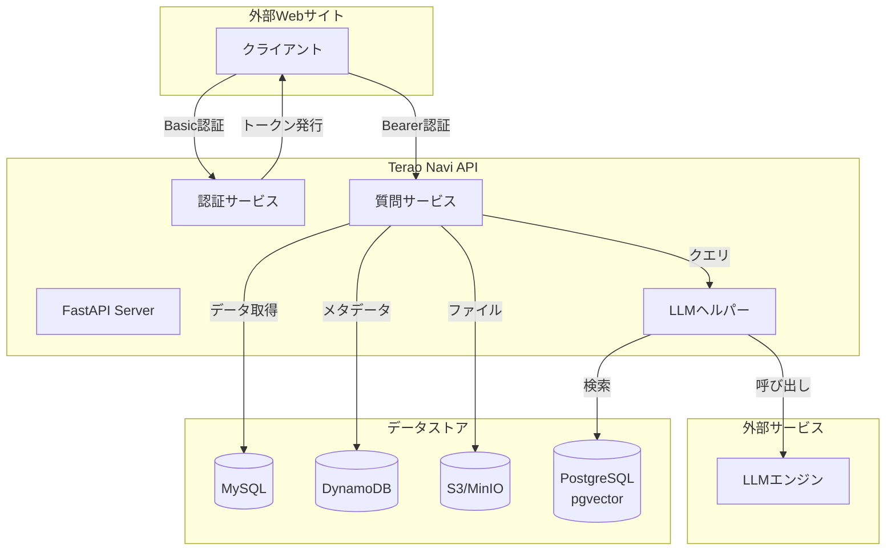
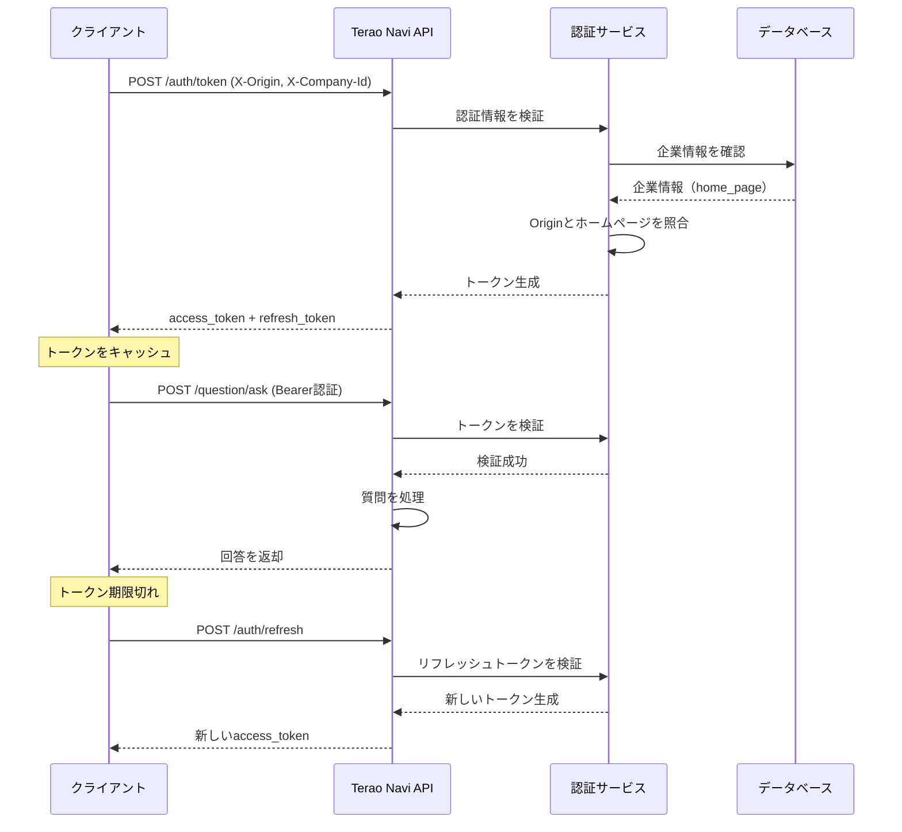

# Terao Navi API

**AIチャットAPI** - LLMベースの質問応答システムを提供するFastAPI

外部Webサイトから簡単に利用できる、セキュアな質問応答APIです。

## 目次

- [特徴](#特徴)
- [アーキテクチャ](#アーキテクチャ)
- [クイックスタート](#クイックスタート)
- [インストール](#インストール)
- [環境構築](#環境構築)
- [API仕様](#api仕様)
- [認証フロー](#認証フロー)
- [開発](#開発)
- [デプロイ](#デプロイ)
- [ライセンス](#ライセンス)

## 特徴

- **高速なAPI** - FastAPIベースの高パフォーマンス
- **セキュアな認証** - Basic認証 + Bearer Token方式
- **LLM統合** - 先進的な言語モデルによる質問応答
- **マルチデータソース** - MySQL, DynamoDB, S3連携
- **ベクトル検索** - PostgreSQL + pgvectorによる高速検索
- **Docker対応** - コンテナ化された開発環境
- **ミドルウェア充実** - リクエスト/レスポンス処理の標準化
- **モジュラー設計** - 保守性の高いアーキテクチャ

## アーキテクチャ

### システム全体構成



### レイヤー構成

```
app/
├── main.py                    # FastAPIアプリケーションエントリーポイント
├── api/
│   ├── depend.py             # 依存性注入
│   └── endpoints/            # APIエンドポイント
├── core/
│   ├── logging.py            # ロギング設定
│   ├── database/             # データベース接続
│   ├── aws/                  # AWS連携
│   └── utils/                # ユーティリティ
├── middlewares/
│   ├── request_wrapper.py    # リクエスト処理
│   ├── response_wrapper.py   # レスポンス処理
│   └── transaction.py        # トランザクション管理
├── models/
│   ├── requests/             # リクエストモデル
│   ├── responses/            # レスポンスモデル
│   ├── mysql/                # MySQLモデル
│   ├── dynamodb/             # DynamoDBモデル
│   └── llm/                  # LLMモデル
├── services/
│   ├── auth_service.py       # 認証サービス
│   └── question_service.py   # 質問応答サービス
├── repositories/
│   └── manual_repository.py  # データアクセス層
└── helpers/
    └── question_llm_helper.py # LLM処理ヘルパー
```

## クイックスタート

### 前提条件

- Python 3.9以上
- Docker & Docker Compose
- AWS CLI（本番環境のみ）

### ローカル環境での起動

```powershell
# 1. リポジトリをクローン
git clone https://github.com/terao06/terao_navi_api.git
cd terao_navi_api

# 2. Dockerコンテナを起動
docker-compose up -d

# 3. 依存関係をインストール
pip install -r requirements.txt

# 4. データベース初期化
python local_setting/local_mysql/run_migrations.py

# 5. S3バケットにテスト用ドキュメントを配置
# local_setting/local_s3/local_buckets/manuals/1/ ディレクトリを作成
New-Item -ItemType Directory -Force -Path "local_setting/local_s3/local_buckets/manuals/1"

# テスト用のPDFファイルを配置（ファイル名は1.pdfとする）
# ※ DB上のapplication_id=1に対応するドキュメントとして認識されます
# 例: Copy-Item "your_document.pdf" -Destination "local_setting/local_s3/local_buckets/manuals/1/1.pdf"

# 6. 開発サーバーを起動
uvicorn app.main:app --reload --host 0.0.0.0 --port 8000
```

APIは `http://localhost:8000` で起動します。

> **注意**: 動作確認時は `local_setting/local_s3/local_buckets/manuals/1/1.pdf` にドキュメントを配置してください。ファイル名は必ず `1.pdf` とする必要があります（vector_dbのlangchain_pg_embeddingにおけるsourceとパスを合わせるため）。

### APIドキュメントの確認

- Swagger UI: `http://localhost:8000/docs`
- ReDoc: `http://localhost:8000/redoc`

## インストール

### Pythonパッケージ

```powershell
# 本番用パッケージ
pip install -r requirements.txt

# 開発用パッケージ（テスト、Lintなど含む）
pip install -r requirements_dev.txt
```

### 主要な依存関係

```txt
fastapi>=0.104.0
uvicorn[standard]>=0.24.0
pydantic>=2.0.0
sqlalchemy>=2.0.0
psycopg2-binary>=2.9.0
boto3>=1.28.0
python-jose[cryptography]
passlib[bcrypt]
```

## 環境構築

### Docker Compose

プロジェクトには以下のサービスが含まれています：

- **MySQL**: アプリケーションデータベース
- **PostgreSQL (pgvector)**: ベクトル検索用DB
- **DynamoDB Local**: メタデータストア
- **MinIO**: S3互換オブジェクトストレージ
- **LocalStack**: AWS サービスのローカルエミュレート

```powershell
# すべてのサービスを起動
docker-compose up -d

# 特定のサービスのみ起動
docker-compose up -d mysql postgres

# ログを確認
docker-compose logs -f

# サービスを停止
docker-compose down
```

### 環境変数

`.env`ファイルを作成して必要な環境変数を設定：

```env
# データベース
MYSQL_HOST=localhost
MYSQL_PORT=3306
MYSQL_USER=root
MYSQL_PASSWORD=password
MYSQL_DATABASE=db_local

# PostgreSQL (pgvector)
POSTGRES_HOST=localhost
POSTGRES_PORT=5432
POSTGRES_USER=postgres
POSTGRES_PASSWORD=password
POSTGRES_DATABASE=vector_db

# AWS (本番環境)
AWS_REGION=ap-northeast-1
AWS_ACCESS_KEY_ID=your_access_key
AWS_SECRET_ACCESS_KEY=your_secret_key

# DynamoDB
DYNAMODB_ENDPOINT=http://localhost:8001
DYNAMODB_TABLE_NAME=your_table_name

# S3/MinIO
S3_ENDPOINT=http://localhost:9000
S3_BUCKET_NAME=manuals

# 認証
JWT_SECRET_KEY=your_secret_key_here
JWT_ALGORITHM=HS256
ACCESS_TOKEN_EXPIRE_MINUTES=30
REFRESH_TOKEN_EXPIRE_DAYS=7

# LLM設定
LLM_MODEL=your_llm_model
LLM_API_KEY=your_llm_api_key
```

## API仕様

### 認証エンドポイント

#### POST `/auth/token`

クライアント認証情報を使ってアクセストークンを取得します。

**リクエスト（カスタムヘッダー認証）:**
```
X-Origin: https://your-website.com
X-Company-Id: 1
```

**レスポンス:**
```json
{
  "access_token": "eyJhbGciOiJIUzI1NiIsInR5cCI6IkpXVCJ9...",
  "refresh_token": "eyJhbGciOiJIUzI1NiIsInR5cCI6IkpXVCJ9...",
  "token_type": "bearer",
  "expires_in": 1800
}
```

#### POST `/auth/refresh`

リフレッシュトークンを使って新しいアクセストークンを取得します。

**リクエスト:**
```json
{
  "refresh_token": "eyJhbGciOiJIUzI1NiIsInR5cCI6IkpXVCJ9..."
}
```

**レスポンス:**
```json
{
  "access_token": "eyJhbGciOiJIUzI1NiIsInR5cCI6IkpXVCJ9...",
  "token_type": "bearer",
  "expires_in": 1800
}
```

### 質問応答エンドポイント

#### POST `/question/ask`

LLMを使って質問に回答します。

**リクエスト（Bearer認証）:**
```
Authorization: Bearer YOUR_ACCESS_TOKEN
Content-Type: application/json
```

```json
{
  "question": "あなたの質問",
  "application_id": 1,
  "context": {
    "session_id": "optional_session_id"
  }
}
```

**レスポンス:**
```json
{
  "answer": "AIからの回答",
  "sources": [
    {
      "document_id": "doc_123",
      "title": "参照元ドキュメント",
      "relevance_score": 0.95
    }
  ],
  "metadata": {
    "model": "gpt-4",
    "tokens_used": 150,
    "processing_time_ms": 1234
  }
}
```

### エラーレスポンス

すべてのエラーは以下の形式で返されます：

```json
{
  "error": {
    "code": "ERROR_CODE",
    "message": "人間が読めるエラーメッセージ",
    "details": {
      "field": "追加の詳細情報"
    }
  }
}
```

**主なエラーコード:**

| コード | HTTPステータス | 説明 |
|--------|---------------|------|
| `UNAUTHORIZED` | 401 | 認証情報が無効または期限切れ |
| `FORBIDDEN` | 403 | アクセス権限がない |
| `NOT_FOUND` | 404 | リソースが見つからない |
| `VALIDATION_ERROR` | 422 | リクエストデータが不正 |
| `RATE_LIMIT_EXCEEDED` | 429 | レート制限を超過 |
| `INTERNAL_ERROR` | 500 | サーバー内部エラー |

## 認証フロー

### 2段階認証方式



### セキュリティのベストプラクティス

1. **Originチェック**: X-Originヘッダーで企業のホームページと照合し、許可されたドメインからのみアクセス可能
2. **企業ID検証**: X-Company-Idヘッダーでデータベース上の企業情報と照合
3. **レート制限**: 過度なリクエストを防ぐ
4. **トークン有効期限**: アクセストークンは短め（30分）、リフレッシュトークンは長め（7日）
5. **HTTPS必須**: 本番環境では必ずHTTPSを使用
6. **ホームページ登録管理**: データベースに登録された企業のホームページのみアクセス許可

## 開発

### 開発サーバーの起動

```powershell
# ホットリロード有効
uvicorn app.main:app --reload --host 0.0.0.0 --port 8000

# または
python -m uvicorn app.main:app --reload
```

### テストの実行

```powershell
# すべてのテストを実行
pytest

# カバレッジ付きで実行
pytest --cov=app --cov-report=html

# 特定のテストファイルを実行
pytest tests/unit/test_auth_service.py

# マーカーを使った実行
pytest -m "not slow"
```

### Lintとフォーマット

```powershell
# flake8でLint
flake8 app/ tests/

# blackでフォーマット
black app/ tests/

# isortでimportを整理
isort app/ tests/

# mypyで型チェック
mypy app/
```

### データベースマイグレーション

```powershell
# マイグレーションファイルを作成
alembic revision --autogenerate -m "Add new table"

# マイグレーションを適用
alembic upgrade head

# マイグレーションをロールバック
alembic downgrade -1
```

### デバッグ

VS Codeのデバッグ設定（`.vscode/launch.json`）：

```json
{
  "version": "0.2.0",
  "configurations": [
    {
      "name": "Python: FastAPI",
      "type": "python",
      "request": "launch",
      "module": "uvicorn",
      "args": [
        "app.main:app",
        "--reload",
        "--host",
        "0.0.0.0",
        "--port",
        "8000"
      ],
      "jinja": true,
      "justMyCode": true
    }
  ]
}
```

## デプロイ

### Dockerイメージのビルド

```powershell
# イメージをビルド
docker build -t terao-navi-api:latest -f docker/local/Dockerfile .

# イメージを実行
docker run -p 8000:8000 --env-file .env terao-navi-api:latest
```

### 本番環境へのデプロイ

#### AWS ECS/Fargateの場合

1. ECRにイメージをプッシュ
2. タスク定義を作成
3. サービスを作成
4. ALBを設定
5. 環境変数を設定（AWS Secrets Manager推奨）

#### Kubernetes/EKSの場合

```yaml
# deployment.yaml
apiVersion: apps/v1
kind: Deployment
metadata:
  name: terao-navi-api
spec:
  replicas: 3
  selector:
    matchLabels:
      app: terao-navi-api
  template:
    metadata:
      labels:
        app: terao-navi-api
    spec:
      containers:
      - name: api
        image: your-registry/terao-navi-api:latest
        ports:
        - containerPort: 8000
        env:
        - name: DATABASE_URL
          valueFrom:
            secretKeyRef:
              name: db-secret
              key: url
```

### 監視とログ

- **ログ**: CloudWatch Logs / ELK Stack
- **メトリクス**: Prometheus + Grafana
- **トレーシング**: AWS X-Ray / Jaeger
- **アラート**: CloudWatch Alarms / PagerDuty

## パフォーマンス最適化

- **データベース接続プーリング**: SQLAlchemyのpoolサイズを調整
- **非同期処理**: FastAPIの非同期エンドポイントを活用
- **キャッシング**: Redis / ElastiCacheでトークンやクエリ結果をキャッシュ
- **ベクトル検索の最適化**: pgvectorのインデックス設定を調整
- **水平スケーリング**: 複数のワーカープロセス/コンテナで分散

## 関連リポジトリ

- **Terao Navi SDK**: https://github.com/terao06/terao_navi_sdk
  - このAPIを利用する外部サイト組み込み用のチャットウィジェットSDK

## ライセンス

このプロジェクトはMITライセンスの下でライセンスされています。詳細は [LICENSE](LICENSE) ファイルをご覧ください。

## 貢献

プルリクエストを歓迎します！大きな変更の場合は、まずissueを開いて変更内容を議論してください。

### 貢献の流れ

1. このリポジトリをフォーク
2. フィーチャーブランチを作成 (`git checkout -b feature/amazing-feature`)
3. 変更をコミット (`git commit -m 'Add some amazing feature'`)
4. ブランチにプッシュ (`git push origin feature/amazing-feature`)
5. プルリクエストを作成
