# Terao Navi API

**AIチャットAPI** - LLMベースの質問応答システムを提供するFastAPI

外部Webサイトから簡単に利用できる、セキュアな質問応答APIです。

## 目次

- [特徴](#特徴)
- [アーキテクチャ](#アーキテクチャ)
- [クイックスタート](#クイックスタート)
- [インストール](#インストール)
- [API仕様](#api仕様)
- [認証フロー](#認証フロー)
- [関連リポジトリ](#関連リポジトリ)
- [ライセンス](#ライセンス)

## 特徴

- **高速なAPI** - FastAPIベースの高パフォーマンス
- **セキュアな認証** - Basic認証 + Bearer Token方式
- **LLM統合** - 先進的な言語モデルによる質問応答
- **マルチデータソース** - MySQL, DynamoDB, S3連携
- **ベクトル検索** - PostgreSQL + pgvectorによる高速検索
- **Docker対応** - コンテナ化された開発環境
- **ミドルウェア充実** - リクエスト/レスポンス処理の標準化
- **モジュラー設計** - 保守性の高いアーキテクチャ

## アーキテクチャ

### システム全体構成


### レイヤー構成

```
app/
├── main.py                    # FastAPIアプリケーションエントリーポイント
├── api/
│   ├── depend.py             # 依存性注入
│   └── endpoints/            # APIエンドポイント
├── core/
│   ├── logging.py            # ロギング設定
│   ├── database/             # データベース接続
│   ├── aws/                  # AWS連携
│   └── utils/                # ユーティリティ
├── middlewares/
│   ├── request_wrapper.py    # リクエスト処理
│   ├── response_wrapper.py   # レスポンス処理
│   └── transaction.py        # トランザクション管理
├── models/
│   ├── requests/             # リクエストモデル
│   ├── responses/            # レスポンスモデル
│   ├── mysql/                # MySQLモデル
│   ├── dynamodb/             # DynamoDBモデル
│   └── llm/                  # LLMモデル
├── services/
│   ├── auth_service.py       # 認証サービス
│   └── question_service.py   # 質問応答サービス
├── repositories/
│   └── manual_repository.py  # データアクセス層
└── helpers/
    └── question_llm_helper.py # LLM処理ヘルパー
```

## クイックスタート

### 前提条件

- Python 3.9以上
- Docker & Docker Compose
- AWS CLI（本番環境のみ）

### ローカル環境での起動

```powershell
# 1. リポジトリをクローン
git clone https://github.com/terao06/terao_navi_api.git
cd terao_navi_api

# 2. embedding モデル設定(ローカル動作時)
pip install -U huggingface-hub
cd terao_navi_api\local_setting\local_app\llm_models
hf download BAAI/bge-m3 --local-dir .

# 2. embedding モデル設定(open aiのAPI使用時)
# local_setting/ssm_data/embedding_setting.json内に以下を設定
#   - model_name: 使用するAPIのモデルを定義
#   - api_key: 作成したapi_keyを設定
#   - app/terao_navi_api/app/models/llm/base_llm_model.pyのUSE_OPEN_AI定数をTrueに変更

# 3, LLMモデルの設定(gpt-oss使用時)
# gpt-ossをダウンロード https://huggingface.co/openai/gpt-oss-20b
# Ollamaの設定を行う https://docs.ollama.com/quickstart

# 3. LLM モデルの設定(open aiのAPI使用時)
# local_setting/ssm_data/llm_setting.json内に以下を設定
#   - model_name: 使用するAPIのモデルを定義
#   - base_url: 削除
#   - api_key: 作成したapi_keyを設定

# 4. Dockerコンテナを起動(MAC OSなど)
Makefile up

# 4. Dockerコンテナを起動(Windows)
make.ps1 up

```

APIは `http://localhost:8005` で起動します。

> **注意**: 動作確認時は `local_setting/local_s3/local_buckets/manuals/1/1.pdf` にドキュメントを配置してください。ファイル名は必ず `1.pdf` とする必要があります（vector_dbのlangchain_pg_embeddingにおけるsourceとパスを合わせるため）。

### APIドキュメントの確認

- Swagger UI: `http://localhost:8005/docs`
- ReDoc: `http://localhost:8005/redoc`

## API仕様

### 認証エンドポイント

#### POST `/auth/token`

クライアント認証情報を使ってアクセストークンを取得します。

**リクエスト（カスタムヘッダー認証）:**
```
Origin: https://your-website.com
X-Company-Id: 1
```

**レスポンス:**
```json
{
    "status": "success",
    "data": {
        "access_token": "5wUc0EaEz29X_KwFAPyhq9s6o...",
        "expires_at": "2026-01-27T14:05:22.233837+00:00",
        "ttl_seconds": 300,
        "refresh_token": "X9WMrompmynJApGlrOf7OBxq5k...",
        "refresh_expires_at": "2026-01-27T15:00:22.233839+00:00",
        "refresh_ttl_seconds": 3600
    }
}
```

#### POST `/auth/refresh`

リフレッシュトークンを使って新しいアクセストークンを取得します。

**リクエスト（ヘッダー認証）:**
```
Authorization: X9WMrompmynJApGlrOf7OBxq5k...
```

**レスポンス:**
```json
{
    "status": "success",
    "data": {
        "access_token": "IUh_y3BDMoVf_5m_PnBawoP7b...",
        "expires_at": "2026-01-27T14:09:55.307701+00:00",
        "ttl_seconds": 300,
        "refresh_token": "VSyYGt3ZUDVYankrqX6-cuPE...",
        "refresh_expires_at": "2026-01-27T15:04:55.307759+00:00",
        "refresh_ttl_seconds": 3600
    }
}
```

### 質問応答エンドポイント

#### POST `/question/ask`

LLMを使って質問に回答します。

**リクエスト（Bearer認証）:**
```
Authorization: Bearer YOUR_ACCESS_TOKEN
Content-Type: application/json
```

```json
{
  "question": "あなたの質問",
  "application_id": 1,
}
```

**レスポンス:**
```json
{
  "status": "success",
  "data": {
    "answer": "AIの回答",
  }
}
```


**主なエラーコード:**

| コード | HTTPステータス | 説明 |
|--------|---------------|------|
| `UNAUTHORIZED` | 401 | 認証情報が無効または期限切れ |
| `FORBIDDEN` | 403 | アクセス権限がない |
| `NOT_FOUND` | 404 | リソースが見つからない |
| `VALIDATION_ERROR` | 422 | リクエストデータが不正 |
| `INTERNAL_ERROR` | 500 | サーバー内部エラー |

## 認証フロー

### 2段階認証方式

```mermaid
sequenceDiagram
    participant Client as クライアント
    participant API as Terao Navi API
    participant Auth as 認証サービス
    participant DB as データベース
    
    Client->>API: POST /auth/token (Origin, X-Company-Id)
    API->>Auth: 認証情報を検証
    Auth->>DB: 企業情報を確認
    DB-->>Auth: 企業情報（home_page）
    Auth->>Auth: Originとホームページを照合
    Auth-->>API: トークン生成
    API-->>Client: access_token + refresh_token
    
    Note over Client: トークンをキャッシュ
    
    Client->>API: POST /question/ask (Bearer認証)
    API->>Auth: トークンを検証
    Auth-->>API: 検証成功
    API->>API: 質問を処理
    API-->>Client: 回答を返却
    
    Note over Client: トークン期限切れ
    
    Client->>API: POST /auth/refresh
    API->>Auth: リフレッシュトークンを検証
    Auth-->>API: 新しいトークン生成
    API-->>Client: 新しいaccess_token
```




### テストの実行

```powershell
# すべてのテストを実行
pytest

# カバレッジ付きで実行
pytest --cov=app --cov-report=html

# 特定のテストファイルを実行
pytest tests/unit/test_auth_service.py

# マーカーを使った実行
pytest -m "not slow"
```

## 関連リポジトリ

- **Terao Navi SDK**: https://github.com/terao06/terao_navi_sdk
  - このAPIを利用する外部サイト組み込み用のチャットウィジェットSDK

## ライセンス

このプロジェクトはMITライセンスの下でライセンスされています。詳細は [LICENSE](LICENSE) ファイルをご覧ください。

## 貢献

プルリクエストを歓迎します！大きな変更の場合は、まずissueを開いて変更内容を議論してください。

### 貢献の流れ

1. このリポジトリをフォーク
2. フィーチャーブランチを作成 (`git checkout -b feature/amazing-feature`)
3. 変更をコミット (`git commit -m 'Add some amazing feature'`)
4. ブランチにプッシュ (`git push origin feature/amazing-feature`)
5. プルリクエストを作成
